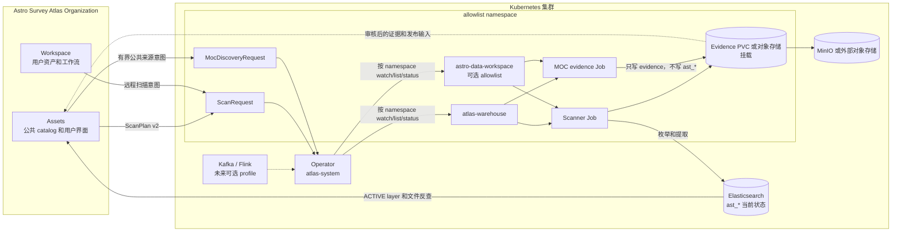

<!--
Copyright 2026 Astro Survey Atlas contributors.
Licensed under the Apache License, Version 2.0 (the "License");
you may not use this file except in compliance with the License.
You may obtain a copy of the License at
http://www.apache.org/licenses/LICENSE-2.0
Unless required by applicable law or agreed to in writing, software
distributed under the License is distributed on an "AS IS" BASIS,
WITHOUT WARRANTIES OR CONDITIONS OF ANY KIND, either express or implied.
See the License for the specific language governing permissions and
limitations under the License.
-->

# Astro Survey Atlas Warehouse（中文）

English documentation: [README.md](README.md)

Astro Survey Atlas Warehouse 是面向天文学的空间目录服务。它枚举本地、S3
兼容和 OSS 数据源，从 FITS header 或 catalog 空间列提取文件级天空覆盖，
并发布 `CoverageLayer` 的当前可查询状态。科学数据仍保留在原始来源，
Warehouse 不代理下载，也不做科学归约。

本仓库是 [Astro Survey Atlas Organization](https://github.com/Astro-Survey-Atlas)
中的一个独立项目：

| 项目 | 边界 |
| --- | --- |
| [Assets](https://github.com/Astro-Survey-Atlas/Assets) | 公共巡天 catalog、MOC、发布制品、重叠计算和反查界面。 |
| [Workspace](https://github.com/Astro-Survey-Atlas/Workspace) | 用户资产、connector、本地工作流和用户工作空间。 |
| [Warehouse](https://github.com/Astro-Survey-Atlas/Warehouse) | 扫描执行、空间提取、当前索引、证据和 Kubernetes 适配。 |

Warehouse 不是工作流引擎、科学数据处理系统、原始数据代理、通用 catalog
或下载服务。`SourceUnit` 是未来可能用于来源分组的概念，v1 不实现。

## 按目标开始

| 目标 | 入口 |
| --- | --- |
| 本地直接运行验证环境 | [`deploy/compose/README.md`](deploy/compose/README.md) |
| 不构建源码直接安装 Kubernetes | [`deploy/helm/README.md`](deploy/helm/README.md) |
| 提交 namespaced 扫描 | [`deploy/kubernetes/README.md`](deploy/kubernetes/README.md) |
| 运行 Kubernetes 自测基线 | [`docs/self-test.md`](docs/self-test.md) |
| 阅读契约和设计 | [`docs/README.md`](docs/README.md) |
| 参与贡献或发布 | [`CONTRIBUTING.md`](CONTRIBUTING.md) 和 [`RELEASING.md`](RELEASING.md) |

默认安装是用于验证的轻量 profile，不等同于高可用生产集群。生产环境应
使用外部 Elasticsearch/对象存储，并自行配置 TLS、认证、备份和资源策略。

## 架构



Operator 是异步适配层。提交请求后会创建或复用不可变 plan 和后台 Job，
调用方只需读取状态，可以继续做其他工作。Operator 不解析 FITS/catalog，
也不在 reconcile 回调中直接写 Elasticsearch。

## 领域对象和扫描契约

v1 只围绕以下对象：

- `CoverageLayer`：一个 survey、release、product 的当前刷新单元。
- `FileAsset`：一个实际发现的文件，ID 是 canonical URI 的稳定哈希。
- `SpatialCoverage`：包含方法、角色和精度的 ICRS/NESTED HEALPix `order/ipix` 关联。
- `ExtractionMode`：一次扫描输入声明的空间语义。
- `SourceSnapshot`：一次运行消费的 inventory 哈希和 evidence。
- `ScanRequest`：Kubernetes 提交对象及可观察状态。

ScanPlan v2 声明一个 source、一个 layer、一个 extraction mode、一个 index
sink 和一个 evidence 路径。支持：

- `fits-wcs`：只读 FITS header，采样线性 WCS，结果为 `estimated`。
- `fits-header-position`：记录显式 header 坐标，结果为 `entrypoint-only`。
- `catalog-radec`：读取配置的 ICRS RA/Dec，生成 `exact` occupancy cell。
- `catalog-healpix`：保留来源显式声明的 NESTED order 和 pixel。

所有 plan 必须在 source 枚举和凭据 I/O 之前校验。FITS 不读取科学数组，
catalog 按文件而不是按行建立 `FileAsset`。不支持的输入必须留下明确证据，
不能伪造 coverage。Coverage 保留真实 order，响应上限通过 `truncated` 单独表达。

## 当前状态索引

Warehouse 只拥有以下 mapping/contract 版本化索引：

```text
ast_layer_index_v1
ast_file_index_v1
ast_coverage_index_v1
```

Layer 刷新状态为 `UPDATING`、`ACTIVE` 或 `FAILED`，只有 `ACTIVE` 可查询。
失败或部分扫描不能伪装成成功的空结果。FileAsset ID 全局按 URI 计算，
coverage edge 按 layer 替换。旧 `astro_*` 索引和冻结的 legacy checkout 永远
不是 runtime fallback。

Evidence 与在线状态分离保存。inventory 哈希、normalized summary、不支持输入
以及写入错误写入 evidence 存储，不放进浏览器初始响应。

## Helm 安装

正式发布后，普通用户可以不克隆源码，直接从组织 registry 拉取 chart：

```bash
helm pull oci://ghcr.io/astro-survey-atlas/charts/atlas-warehouse-infra \
  --version 0.1.1 --untar
helm install atlas-warehouse ./atlas-warehouse-infra \
  --namespace atlas-warehouse --create-namespace --wait --timeout 15m
```

基础设施 chart 默认安装 Elasticsearch、MinIO 和严格的 `ast_*` bootstrap。
安装前先在目标 namespace 创建 MinIO credential Secret。Kafka 默认关闭；
只有未来事件驱动 profile 才显式开启：

```bash
helm upgrade --install atlas-warehouse \
  oci://ghcr.io/astro-survey-atlas/charts/atlas-warehouse-infra \
  --version 0.1.1 --namespace atlas-warehouse --create-namespace \
  --set kafka.enabled=true
```

Operator 是独立 chart，并且必须指定 namespace allowlist：

```bash
helm upgrade --install atlas-warehouse-operator \
  oci://ghcr.io/astro-survey-atlas/charts/atlas-warehouse-operator \
  --version 0.1.1 --namespace atlas-system --create-namespace \
  --set 'watchNamespaces[0]=atlas-warehouse'
```

registry、版本、存储、升级回滚、卸载、健康检查和 Secret 规则见
[`deploy/helm/README.md`](deploy/helm/README.md)。

## Docker Compose 本地验证

Compose 用于本地验证闭环，启动搜索和 evidence 依赖、初始化三个索引，并可
运行 query/scanner image；它不模拟 Kubernetes Operator：

```bash
docker compose -f deploy/compose/compose.yaml up -d
docker compose -f deploy/compose/compose.yaml ps
```

需要执行扫描时，按 [`deploy/compose/README.md`](deploy/compose/README.md)
挂载 plan 和 evidence 目录。Kafka 同样只在显式 Compose profile 中启用。

## 开发与贡献

```bash
mvn -B verify
mvn -B package
```

开发提取器时可不连接 Elasticsearch：

```bash
java -jar scanner-cli/target/scanner-cli-0.1.0-SNAPSHOT-runner.jar \
  --plan /path/to/scan-plan.json --memory
```

模块职责和契约入口见 [`docs/README.md`](docs/README.md)。任何稳定产品规则的
改变都必须同时更新契约和 ADR。不要修改冻结的
`/home/aaron/Repo/data-warehouse` checkout。

本项目使用 Apache-2.0，但属于 Astro Survey Atlas Organization，并非 Apache
Software Foundation 项目。法律与治理文件见 [`LICENSE`](LICENSE)、
[`NOTICE`](NOTICE)、[`CONTRIBUTING.md`](CONTRIBUTING.md)、
[`SECURITY.md`](SECURITY.md) 和 [`GOVERNANCE.md`](GOVERNANCE.md)。

## 延伸阅读

- [`CONTEXT.md`](CONTEXT.md)：统一领域词汇。
- [`docs/architecture.md`](docs/architecture.md)：组件、namespace 和 ownership 图。
- [`docs/scan-plan.md`](docs/scan-plan.md)：ScanPlan v2 输入和校验。
- [`docs/index-contract.md`](docs/index-contract.md)：Elasticsearch 文档和空间语义。
- [`docs/query-api.md`](docs/query-api.md)：诊断查询和分页。
- [`docs/operator.md`](docs/operator.md)：ScanRequest、Job、evidence 和 namespace 契约。
- [`docs/moc-discovery.md`](docs/moc-discovery.md)：只写 evidence 的公共 MOC discovery。
- [`docs/sourceunit-roadmap.md`](docs/sourceunit-roadmap.md)：v1 之后的演进边界。
