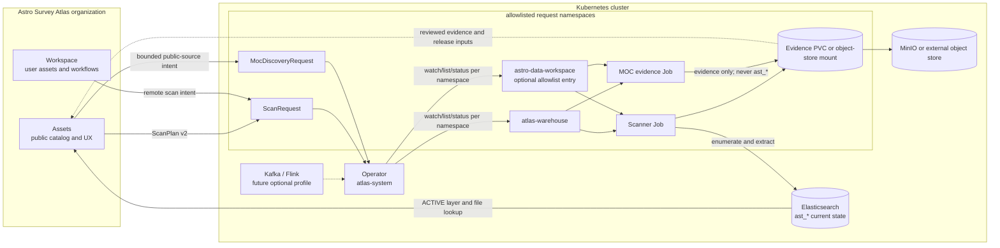

<!--
Copyright 2026 Astro Survey Atlas contributors.
Licensed under the Apache License, Version 2.0 (the "License");
you may not use this file except in compliance with the License.
You may obtain a copy of the License at
http://www.apache.org/licenses/LICENSE-2.0
Unless required by applicable law or agreed to in writing, software
distributed under the License is distributed on an "AS IS" BASIS,
WITHOUT WARRANTIES OR CONDITIONS OF ANY KIND, either express or implied.
See the License for the specific language governing permissions and
limitations under the License.
-->

# Astro Survey Atlas Warehouse

中文文档：[README.cn.md](README.cn.md)

Astro Survey Atlas Warehouse is the astronomy-specific spatial directory for
public or configured astronomy files. It enumerates local, S3-compatible, and
OSS sources, extracts file-level sky coverage from metadata, and publishes the
current searchable state of `CoverageLayer` records. Scientific payloads stay
at their original source; Warehouse does not proxy or reduce them.

This repository is one of three cooperating projects in the
[Astro Survey Atlas organization](https://github.com/Astro-Survey-Atlas):

| Project | Boundary |
| --- | --- |
| [Assets](https://github.com/Astro-Survey-Atlas/Assets) | Public survey catalog, MOCs, release artifacts, overlap UI, and reverse lookup. |
| [Workspace](https://github.com/Astro-Survey-Atlas/Workspace) | User assets, connectors, local workflows, and the user-facing workspace. |
| [Warehouse](https://github.com/Astro-Survey-Atlas/Warehouse) | Scan execution, spatial extraction, current indices, evidence, and Kubernetes translation. |

Warehouse is not a workflow engine, scientific reduction system, raw-data
proxy, universal catalog, or download service. `SourceUnit` is reserved for a
future source-grouping contract and is not part of v1.

## Choose A Path

| Need | Start here |
| --- | --- |
| Run the bundled services locally | [`deploy/compose/README.md`](deploy/compose/README.md) |
| Install on Kubernetes without building source | [`deploy/helm/README.md`](deploy/helm/README.md) |
| Submit a namespaced scan | [`deploy/kubernetes/README.md`](deploy/kubernetes/README.md) |
| Run the Kubernetes self-test baseline | [`docs/self-test.md`](docs/self-test.md) |
| Understand the contracts | [`docs/README.md`](docs/README.md) |
| Contribute or prepare a release | [`CONTRIBUTING.md`](CONTRIBUTING.md) and [`RELEASING.md`](RELEASING.md) |

The default installation is a small validation profile, not a highly available
production cluster. Use external Elasticsearch/object storage and production
security controls for a real survey service.

## Architecture



The Operator is an asynchronous adapter. A submitted request creates or adopts
an immutable plan and a background Job; the caller reads status and can perform
other work while the scan runs. The Operator never parses FITS/catalog data or
writes Elasticsearch from a reconcile callback.

## Domain And Contracts

The v1 domain is intentionally small:

- `CoverageLayer`: one survey, release, and product refreshed as one current-state unit.
- `FileAsset`: one discovered file identified by a canonical-URI hash.
- `SpatialCoverage`: one ICRS/NESTED HEALPix `order/ipix` association with method, role, and precision.
- `ExtractionMode`: the declared spatial meaning of one scan input.
- `SourceSnapshot`: the hashed inventory and evidence consumed by one run.
- `ScanRequest`: the Kubernetes submission and observable execution status.

`ScanPlan` v2 declares one source, one layer, one extraction mode, one index
sink, and one evidence path. The supported modes are:

- `fits-wcs`: sample supported linear WCS from FITS headers; output is `estimated`.
- `fits-header-position`: record an explicit header position as `entrypoint-only`.
- `catalog-radec`: map configured ICRS RA/Dec columns to exact occupancy cells.
- `catalog-healpix`: preserve explicit NESTED source order and pixel values.

Plans are validated before source enumeration or credentialed I/O. FITS arrays
are never read, catalogs create one `FileAsset` per file, and unsupported input
remains explicit evidence rather than fabricated coverage. Coverage retains its
actual order; a response limit is reported as `truncated` separately from
coverage precision.

## Current-State Indices

Warehouse owns only these mapping-versioned indices:

```text
ast_layer_index_v1
ast_file_index_v1
ast_coverage_index_v1
```

Layer refreshes move through `UPDATING`, `ACTIVE`, or `FAILED`; only `ACTIVE`
layers are queryable. Failed or partial scans never masquerade as an empty
successful layer. File IDs are global URI hashes, while coverage edges are
replaced per layer. Legacy `astro_*` indices and the frozen reference checkout
are never runtime fallbacks.

Evidence is separate from online state. Inventory hashes, normalized summaries,
unsupported inputs, and write errors remain on the evidence volume and are not
part of the browser's initial response.

## Install With Helm

For a published release, pull the chart from the organization registry without
cloning this repository:

```bash
helm pull oci://ghcr.io/astro-survey-atlas/charts/atlas-warehouse-infra \
  --version 0.1.1 --untar
helm install atlas-warehouse ./atlas-warehouse-infra \
  --namespace atlas-warehouse --create-namespace --wait --timeout 15m
```

The chart installs Elasticsearch, MinIO, and strict `ast_*` bootstrap. Create
the MinIO credential Secret before installation. Kafka is disabled by default;
enable it only for a future event-driven profile:

```bash
helm upgrade --install atlas-warehouse \
  oci://ghcr.io/astro-survey-atlas/charts/atlas-warehouse-infra \
  --version 0.1.1 --namespace atlas-warehouse --create-namespace \
  --set kafka.enabled=true
```

The Operator is a separate chart and requires an explicit namespace allowlist:

```bash
helm upgrade --install atlas-warehouse-operator \
  oci://ghcr.io/astro-survey-atlas/charts/atlas-warehouse-operator \
  --version 0.1.1 --namespace atlas-system --create-namespace \
  --set 'watchNamespaces[0]=atlas-warehouse'
```

See [`deploy/helm/README.md`](deploy/helm/README.md) for registry values,
storage, upgrades, rollback, uninstall, health checks, and secret handling.

## Run The Local Compose Profile

Compose is for a local validation loop. It starts the search and evidence
dependencies, initializes the three indices, and can run query/scanner images;
it does not pretend to run a Kubernetes Operator:

```bash
docker compose -f deploy/compose/compose.yaml up -d
docker compose -f deploy/compose/compose.yaml ps
```

Use the scanner profile with a mounted plan and evidence directory as described
in [`deploy/compose/README.md`](deploy/compose/README.md). Kafka remains an
explicit opt-in Compose profile as well.

## Development

```bash
mvn -B verify
mvn -B package
```

Run a scan without Elasticsearch while developing an extractor:

```bash
java -jar scanner-cli/target/scanner-cli-0.1.0-SNAPSHOT-runner.jar \
  --plan /path/to/scan-plan.json --memory
```

The module responsibilities and contracts are indexed in
[`docs/README.md`](docs/README.md). Changes to a stable product rule must update
the relevant contract and ADR. Do not edit the frozen
`/home/aaron/Repo/data-warehouse` checkout.

## Project Governance

This is an Apache-2.0 project in the Astro Survey Atlas organization; it is not
an Apache Software Foundation project. See [`LICENSE`](LICENSE),
[`NOTICE`](NOTICE), [`CONTRIBUTING.md`](CONTRIBUTING.md),
[`SECURITY.md`](SECURITY.md), and [`GOVERNANCE.md`](GOVERNANCE.md).

## Further Reading

- [`CONTEXT.md`](CONTEXT.md): canonical domain vocabulary.
- [`docs/architecture.md`](docs/architecture.md): component, namespace, and ownership diagrams.
- [`docs/scan-plan.md`](docs/scan-plan.md): ScanPlan v2 input and validation.
- [`docs/index-contract.md`](docs/index-contract.md): Elasticsearch documents and spatial semantics.
- [`docs/query-api.md`](docs/query-api.md): diagnostic lookup and pagination.
- [`docs/operator.md`](docs/operator.md): ScanRequest, Job, evidence, and namespace contract.
- [`docs/moc-discovery.md`](docs/moc-discovery.md): evidence-only public MOC discovery.
- [`docs/sourceunit-roadmap.md`](docs/sourceunit-roadmap.md): post-v1 evolution boundary.
