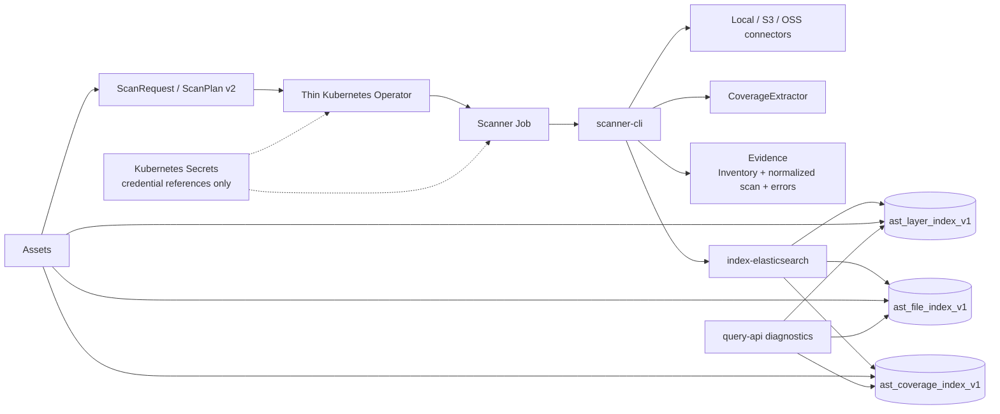

# Astro Survey Atlas Warehouse

中文文档：[README.cn.md](README.cn.md)

An astronomy-specific spatial directory for discovering public or configured
astronomy files. Warehouse enumerates local, S3-compatible, and OSS sources,
extracts file-level sky coverage from metadata, and maintains the current
searchable state of CoverageLayers. Users continue to download scientific
payloads from the original source locations.

## Product Shape

The v1 domain is deliberately small:

- `CoverageLayer`: one survey, release, and product refreshed as one current-state unit.
- `FileAsset`: one discovered file identified by a stable hash of its canonical URI.
- `SpatialCoverage`: an ICRS, NESTED HEALPix `order/ipix` association with method, role, and precision.
- `ExtractionMode`: the declared spatial meaning of a scan input.
- `SourceSnapshot`: the hashed inventory and evidence for one scan execution.
- `ScanRequest`: the Kubernetes submission and observable execution status.

Warehouse is not a workflow engine, scientific reduction pipeline, raw-data
proxy, universal catalog, or download service. `SourceUnit` is reserved and is
not implemented in v1.

## Architecture



The Operator validates and translates plans, while the Scanner owns source
enumeration, metadata extraction, evidence, and writes. Assets reads the three
current-state `ast_*` indices directly in production; Query API is a read-only
diagnostic surface.

## Modules

| Module | Responsibility |
| --- | --- |
| `spatial-core` | Domain types, ScanPlan v2 validation, HEALPix rules, and reader/writer interfaces. |
| `scanner-cli` | Local/S3/OSS enumeration, FITS and catalog extraction, evidence, and scan execution. |
| `index-elasticsearch` | Strict mappings, leases, current-layer replacement, bounded bulk writes, and reads. |
| `query-api` | Read-only point, cone, and explicit-order HEALPix diagnostics. |
| `operator` | Namespaced `ScanRequest` validation, Secret projection, Jobs, and status reporting. |
| `moc-discovery-cli` | Controlled MOC discovery evidence jobs; it does not write `ast_*`. |

## Scan Contract

ScanPlan v2 declares one source, one layer, one extraction mode, one index
sink, and an evidence path. The supported modes are:

- `fits-wcs`: sample supported linear TAN WCS from FITS headers; output is `estimated`.
- `fits-header-position`: index an explicit FITS header position as `entrypoint-only`.
- `catalog-radec`: map configured ICRS RA/Dec columns to deduplicated cells with `exact` precision.
- `catalog-healpix`: preserve explicit NESTED source order and pixel values.

FITS processing reads headers only. Catalog processing reads configured
spatial columns and creates one `FileAsset` per file, not one document per row.
Every plan is validated before source enumeration or credentialed I/O.

Coverage keeps its actual order and precision. Coarsening finer cells is valid;
expanding coarse cells into finer coverage is forbidden. A response limit is
reported separately as `truncated`.

## Current-State Indices

Warehouse owns only these new indices:

```text
ast_layer_index_v1
ast_file_index_v1
ast_coverage_index_v1
```

`v1` versions mappings and contracts, not scan runs. A layer refresh moves
through `UPDATING`, `ACTIVE`, or `FAILED`; only `ACTIVE` layers are queryable.
Failed or partial coverage never appears as an empty successful result. File
IDs are global canonical-URI hashes, while coverage edges are replaced per
layer. Legacy `astro_*` indices and the frozen reference repository are not
runtime fallbacks.

## Evidence And Security

Persisted scans write inventory, source hashes, normalized summaries, and
extraction/write errors to an explicit PVC or object-store-backed evidence
mount. Credentials are represented only by Kubernetes Secret or environment
references. They must not appear in plans, evidence, logs, indices, or query
responses. Scientific arrays and raw files never pass through Warehouse.

## Build And Run

Run the complete Maven verification from the repository root:

```bash
mvn test
mvn package
```

Run a local diagnostic scan without Elasticsearch:

```bash
java -jar scanner-cli/target/scanner-cli-0.1.0-SNAPSHOT-runner.jar \
  --plan /path/to/scan-plan.json --memory
```

For a persisted Kubernetes run, apply the namespace, CRD, RBAC, Operator
Deployment, evidence PVC, credential Secret, and a `ScanRequest` manifest in
that order. The checked-in examples and the self-managed infrastructure chart
are documented in [`deploy/kubernetes/README.md`](deploy/kubernetes/README.md)
and [`deploy/helm/atlas-warehouse-infra`](deploy/helm/atlas-warehouse-infra).

The infrastructure chart installs Elasticsearch and MinIO by default. Kafka is
optional (`--set kafka.enabled=true`) and is not used by the current
Scanner/Operator path; it is reserved for a future event-driven or Flink
deployment profile.

## Contracts And Further Reading

- [`HANDOFF.md`](HANDOFF.md): operational continuation point and deployment notes.
- [`CONTEXT.md`](CONTEXT.md): canonical domain vocabulary.
- [`docs/requirements.md`](docs/requirements.md): product requirements and completion criteria.
- [`docs/architecture.md`](docs/architecture.md): module ownership and refresh sequence.
- [`docs/scan-plan.md`](docs/scan-plan.md): ScanPlan v2 input and validation contract.
- [`docs/index-contract.md`](docs/index-contract.md): Elasticsearch documents and spatial semantics.
- [`docs/query-api.md`](docs/query-api.md): diagnostic query and pagination contract.
- [`docs/operator.md`](docs/operator.md): ScanRequest, Job, evidence, and Secret-reference contract.

---
