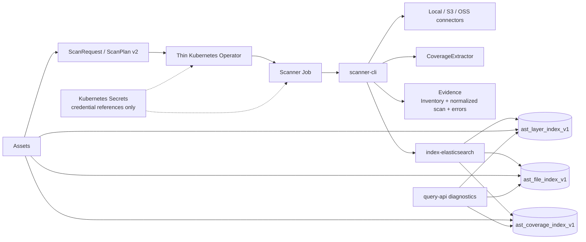

# Astro Survey Atlas Warehouse

An astronomy-specific spatial directory for discovering public or configured
astronomy files. Warehouse enumerates local, S3-compatible, and OSS sources,
extracts file-level sky coverage from metadata, and maintains the current
searchable state of CoverageLayers. Users continue to download scientific
payloads from the original source locations.

## Product Shape

The v1 domain is deliberately small:

- `CoverageLayer`: one survey, release, and product refreshed as one current-state unit.
- `FileAsset`: one discovered file identified by a stable hash of its canonical URI.
- `SpatialCoverage`: an ICRS, NESTED HEALPix `order/ipix` association with method, role, and precision.
- `ExtractionMode`: the declared spatial meaning of a scan input.
- `SourceSnapshot`: the hashed inventory and evidence for one scan execution.
- `ScanRequest`: the Kubernetes submission and observable execution status.

Warehouse is not a workflow engine, scientific reduction pipeline, raw-data
proxy, universal catalog, or download service. `SourceUnit` is reserved and is
not implemented in v1.

## Architecture



The Operator validates and translates plans, while the Scanner owns source
enumeration, metadata extraction, evidence, and writes. Assets reads the three
current-state `ast_*` indices directly in production; Query API is a read-only
diagnostic surface.

## Modules

| Module | Responsibility |
| --- | --- |
| `spatial-core` | Domain types, ScanPlan v2 validation, HEALPix rules, and reader/writer interfaces. |
| `scanner-cli` | Local/S3/OSS enumeration, FITS and catalog extraction, evidence, and scan execution. |
| `index-elasticsearch` | Strict mappings, leases, current-layer replacement, bounded bulk writes, and reads. |
| `query-api` | Read-only point, cone, and explicit-order HEALPix diagnostics. |
| `operator` | Namespaced `ScanRequest` validation, Secret projection, Jobs, and status reporting. |
| `moc-discovery-cli` | Controlled MOC discovery evidence jobs; it does not write `ast_*`. |

## Scan Contract

ScanPlan v2 declares one source, one layer, one extraction mode, one index
sink, and an evidence path. The supported modes are:

- `fits-wcs`: sample supported linear TAN WCS from FITS headers; output is `estimated`.
- `fits-header-position`: index an explicit FITS header position as `entrypoint-only`.
- `catalog-radec`: map configured ICRS RA/Dec columns to deduplicated cells with `exact` precision.
- `catalog-healpix`: preserve explicit NESTED source order and pixel values.

FITS processing reads headers only. Catalog processing reads configured
spatial columns and creates one `FileAsset` per file, not one document per row.
Every plan is validated before source enumeration or credentialed I/O.

Coverage keeps its actual order and precision. Coarsening finer cells is valid;
expanding coarse cells into finer coverage is forbidden. A response limit is
reported separately as `truncated`.

## Current-State Indices

Warehouse owns only these new indices:

```text
ast_layer_index_v1
ast_file_index_v1
ast_coverage_index_v1
```

`v1` versions mappings and contracts, not scan runs. A layer refresh moves
through `UPDATING`, `ACTIVE`, or `FAILED`; only `ACTIVE` layers are queryable.
Failed or partial coverage never appears as an empty successful result. File
IDs are global canonical-URI hashes, while coverage edges are replaced per
layer. Legacy `astro_*` indices and the frozen reference repository are not
runtime fallbacks.

## Evidence And Security

Persisted scans write inventory, source hashes, normalized summaries, and
extraction/write errors to an explicit PVC or object-store-backed evidence
mount. Credentials are represented only by Kubernetes Secret or environment
references. They must not appear in plans, evidence, logs, indices, or query
responses. Scientific arrays and raw files never pass through Warehouse.

## Build And Run

Run the complete Maven verification from the repository root:

```bash
mvn test
mvn package
```

Run a local diagnostic scan without Elasticsearch:

```bash
java -jar scanner-cli/target/scanner-cli-0.1.0-SNAPSHOT-runner.jar \
  --plan /path/to/scan-plan.json --memory
```

For a persisted Kubernetes run, apply the namespace, CRD, RBAC, Operator
Deployment, evidence PVC, credential Secret, and a `ScanRequest` manifest in
that order. The checked-in examples and the self-managed infrastructure chart
are documented in [`deploy/kubernetes/README.md`](deploy/kubernetes/README.md)
and [`deploy/helm/atlas-warehouse-infra`](deploy/helm/atlas-warehouse-infra).

## Contracts And Further Reading

- [`HANDOFF.md`](HANDOFF.md): operational continuation point and deployment notes.
- [`CONTEXT.md`](CONTEXT.md): canonical domain vocabulary.
- [`docs/requirements.md`](docs/requirements.md): product requirements and completion criteria.
- [`docs/architecture.md`](docs/architecture.md): module ownership and refresh sequence.
- [`docs/scan-plan.md`](docs/scan-plan.md): ScanPlan v2 input and validation contract.
- [`docs/index-contract.md`](docs/index-contract.md): Elasticsearch documents and spatial semantics.
- [`docs/query-api.md`](docs/query-api.md): diagnostic query and pagination contract.
- [`docs/operator.md`](docs/operator.md): ScanRequest, Job, evidence, and Secret-reference contract.

---

# Astro Survey Atlas Warehouse（中文）

这是一个面向天文学的空间目录服务，用于发现公开或已配置的数据文件。
Warehouse 枚举本地、S3 兼容和 OSS 数据源，从元数据提取文件级天空覆盖，
并维护可查询的 CoverageLayer 当前状态。科学数据仍由用户从原始来源下载。

## 产品边界

v1 只围绕以下领域对象展开：

- `CoverageLayer`：一个 survey、release 和 product 组成的当前刷新单元。
- `FileAsset`：一个实际发现的文件，ID 是 canonical URI 的稳定哈希。
- `SpatialCoverage`：带有方法、角色和精度的 ICRS/NESTED HEALPix `order/ipix` 关联。
- `ExtractionMode`：扫描输入声明的空间语义。
- `SourceSnapshot`：一次扫描的带哈希 inventory 和 evidence。
- `ScanRequest`：Kubernetes 提交对象及可观察的执行状态。

Warehouse 不是工作流引擎、科学数据归约管线、原始数据代理、通用 catalog
或下载服务。`SourceUnit` 仅保留为未来概念，v1 尚未实现。

## 架构说明

上方 Mermaid 图展示同一条主链路：Assets 提交 ScanRequest/ScanPlan v2，
Thin Operator 创建 Scanner Job；Scanner 通过本地/S3/OSS connector 枚举文件，
由 CoverageExtractor 读取 FITS header 或 catalog 空间列，同时生成 evidence，
最后写入三个 `ast_*` 当前状态索引。Assets 生产环境直接读取这些索引，
`query-api` 只承担只读诊断职责。Kubernetes Secret 只投影凭据引用，绝不把
凭据值放进 plan、evidence、日志或查询响应。

## 模块

| 模块 | 职责 |
| --- | --- |
| `spatial-core` | 领域类型、ScanPlan v2 校验、HEALPix 规则和读写接口。 |
| `scanner-cli` | 本地/S3/OSS 枚举、FITS/catalog 提取、evidence 和扫描执行。 |
| `index-elasticsearch` | 严格 mapping、lease、当前 layer 替换、有界 bulk 写入和读取。 |
| `query-api` | 只读 point、cone 和显式 order HEALPix 诊断接口。 |
| `operator` | namespaced `ScanRequest` 校验、Secret 投影、Job 和状态报告。 |
| `moc-discovery-cli` | 受控 MOC discovery evidence Job，不写入 `ast_*`。 |

## 扫描契约

ScanPlan v2 声明一个 source、一个 layer、一个 extraction mode、一个 index
sink 和一个 evidence 路径。支持的模式为：

- `fits-wcs`：只从 FITS header 采样受支持的线性 TAN WCS，结果精度为 `estimated`。
- `fits-header-position`：把显式 FITS header 坐标记录为 `entrypoint-only`。
- `catalog-radec`：读取配置的 ICRS RA/Dec 列，生成去重且 `exact` 的覆盖 cell。
- `catalog-healpix`：保留来源显式声明的 NESTED order 和 pixel。

FITS 不读取科学数组；catalog 按文件创建 `FileAsset`，不会按行创建索引文档。
所有 plan 必须在 source 枚举和凭据 I/O 之前完成校验。

Coverage 保留实际 order 和 precision。可以把细粒度 cell 合并到更粗 order，
但不能把粗 cell 扩展成虚假的细粒度覆盖。响应限制通过 `truncated` 单独报告。

## 当前状态索引

Warehouse 只拥有以下新索引：

```text
ast_layer_index_v1
ast_file_index_v1
ast_coverage_index_v1
```

`v1` 表示 mapping/contract 版本，不表示扫描运行次数。Layer 刷新状态依次
使用 `UPDATING`、`ACTIVE` 或 `FAILED`；只有 `ACTIVE` 可查询。失败或部分覆盖
不能伪装成成功的空结果。FileAsset ID 是全局 canonical URI 哈希，coverage edge
按 layer 替换。旧 `astro_*` 索引和冻结的 legacy 仓库不作为运行时 fallback。

## Evidence 与安全

持久化扫描把 inventory、source hash、normalized summary 以及提取/写入错误写入
显式 PVC 或由对象存储支持的 evidence mount。凭据只能通过 Kubernetes Secret
或环境引用表达，不能出现在 plan、evidence、日志、索引或查询响应中。原始文件
和科学数组不会经过 Warehouse。

## 构建与运行

在仓库根目录执行完整 Maven 验证：

```bash
mvn test
mvn package
```

不连接 Elasticsearch，运行本地诊断扫描：

```bash
java -jar scanner-cli/target/scanner-cli-0.1.0-SNAPSHOT-runner.jar \
  --plan /path/to/scan-plan.json --memory
```

持久化 Kubernetes 扫描按 namespace、CRD、RBAC、Operator Deployment、evidence
PVC、credential Secret、ScanRequest 的顺序部署。完整示例见
[`deploy/kubernetes/README.md`](deploy/kubernetes/README.md) 和
[`deploy/helm/atlas-warehouse-infra`](deploy/helm/atlas-warehouse-infra)。

## 契约与延伸阅读

- [`HANDOFF.md`](HANDOFF.md)：运维续接点和部署说明。
- [`CONTEXT.md`](CONTEXT.md)：统一领域词汇。
- [`docs/requirements.md`](docs/requirements.md)：产品需求和完成标准。
- [`docs/architecture.md`](docs/architecture.md)：模块边界和刷新流程。
- [`docs/scan-plan.md`](docs/scan-plan.md)：ScanPlan v2 输入及校验契约。
- [`docs/index-contract.md`](docs/index-contract.md)：Elasticsearch 文档和空间语义。
- [`docs/query-api.md`](docs/query-api.md)：诊断查询和分页契约。
- [`docs/operator.md`](docs/operator.md)：ScanRequest、Job、evidence 和 Secret 引用契约。
