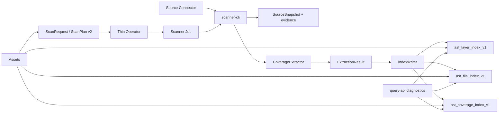

# Architecture

## Data Flow



## Module Interfaces

### `spatial-core`

Owns CoverageLayer, FileAsset, SpatialCoverage, LayerSpec, ExtractionSpec,
ScanPlan, validation, stable identities, explicit HEALPix order/ipix rules, and
the IndexReader/IndexWriter interfaces. It knows no Kubernetes or transport
lifecycle.

### `scanner-cli`

Owns source enumeration, source snapshot hashing, CoverageExtractor resolution,
FITS/catalog parsing, evidence summaries, batches, and layer update execution.
The external seam is one ExtractionSpec; extractor composition remains internal.

```text
InputItem + SourceContent + ExtractionSpec
  -> ExtractionResult(coverages, counters, errors)
```

### `index-elasticsearch`

Owns strict mappings, bounded bulk transport, current-layer leases, deletion by
layer, ACTIVE state, multi-order cell search, and FileAsset lookup. It writes
only the three fixed `ast_*` indices.

### `query-api`

Owns a diagnostic read-only HTTP surface. It validates layer/order/cell input,
requires ACTIVE layers, joins coverage edges to FileAssets, and reports
precision and truncation. Assets may implement the same documented reads
directly against Elasticsearch.

### `operator`

Owns `ScanRequest` parsing, secret reference projection, immutable plan
ConfigMaps, scanner Jobs, resource policy, and CR status. It labels Jobs by
layer and waits rather than starting a second active execution for that layer.

## Refresh Sequence

```mermaid
sequenceDiagram
  participant S as Scanner
  participant E as Elasticsearch
  participant V as Evidence storage
  S->>E: tryBeginLayerUpdate(layer, run, lease)
  E-->>S: acquired or conflict
  S->>S: enumerate and hash SourceSnapshot
  S->>E: deleteCoverageForLayer(layer)
  S->>V: write inventory/errors/normalized evidence
  S->>E: upsert FileAssets and SpatialCoverage batches
  S->>E: verify counts, mark ACTIVE
  Note over S,E: On failure mark FAILED; partial coverage remains hidden
```

FileAsset IDs remain global URI hashes. SpatialCoverage IDs include layer ID,
so replacement never deletes another layer's association with the same file.

## Deployment Ownership

The repository Helm release `deploy/helm/atlas-warehouse-infra` owns the new
runtime dependencies in namespace `atlas-warehouse`: single-node
Elasticsearch, standalone MinIO, Kafka, and strict `ast_*` index bootstrap. The
Operator runs in `atlas-system` but watches only `atlas-warehouse`; its Scanner
Jobs, evidence PVCs, and source credentials are namespace-local. The legacy
`warehouse` Helm release is a migration reference only and is not part of this
runtime path.
