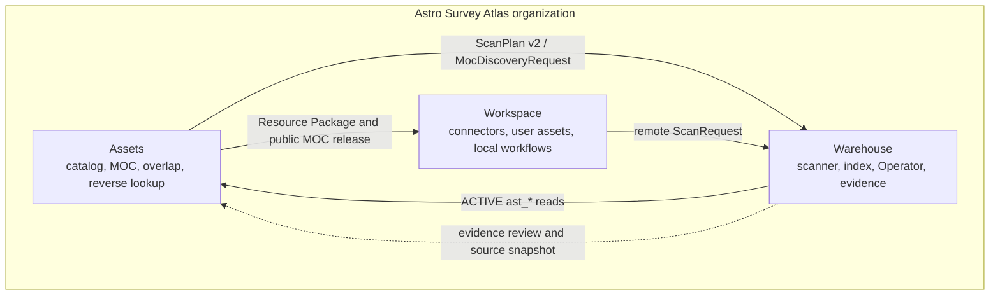
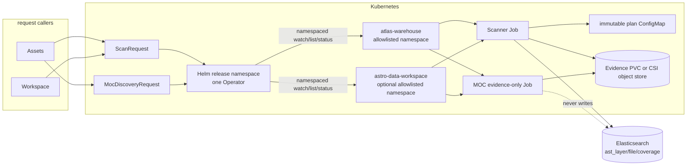
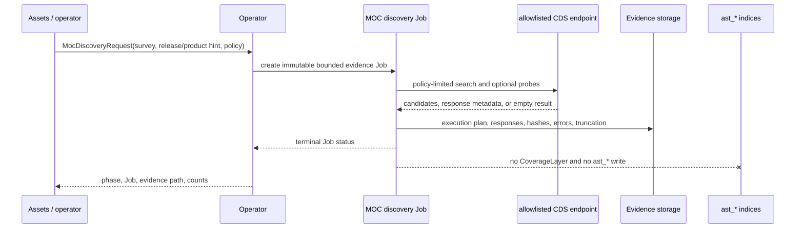

<!--
Copyright 2026 Astro Survey Atlas contributors.
Licensed under the Apache License, Version 2.0 (the "License");
you may not use this file except in compliance with the License.
You may obtain a copy of the License at
http://www.apache.org/licenses/LICENSE-2.0
Unless required by applicable law or agreed to in writing, software
distributed under the License is distributed on an "AS IS" BASIS,
WITHOUT WARRANTIES OR CONDITIONS OF ANY KIND, either express or implied.
See the License for the specific language governing permissions and
limitations under the License.
-->

# Architecture

## System Context

Warehouse is the execution and current-state boundary for the three-project
Astro Survey Atlas organization. Assets owns public presentation and release
artifacts. Workspace owns user assets and local workflows. Warehouse accepts a
finite scan intent, produces current file/coverage state, and retains evidence
for review.



Cross-project references are contracts, not shared runtime code. Warehouse does
not import Assets or Workspace internals and never uses local sibling paths as a
runtime dependency.

## Request And Ownership Flow



The Operator is asynchronous. It validates the request, materializes an
immutable secret-free plan, creates or adopts a Job, and reports Job status.
The caller does not keep an HTTP or CLI process in the foreground while the
Job enumerates a large source. A changed plan creates a new execution identity;
an equivalent active or successful Job is adopted instead of duplicated.

Every generated Job, ConfigMap, evidence mount, and credential reference is
namespace-local to its request. Kubernetes owner references are only used
within that namespace. The Operator ServiceAccount lives in the Helm release
namespace, while its permissions are granted by one Role/RoleBinding pair per
allowlisted request namespace. The default release watches `atlas-warehouse`;
Workspace is an explicit opt-in.

## MOC Discovery Boundary



`MocDiscoveryRequest` is intent-only. The fixed `cds-public-moc-v2` policy
controls hosts, request count, response bytes, candidate limits, and
timeout. A zero candidate count is a bounded upstream result, not proof that a
survey has no public MOC. Assets decides whether reviewed evidence becomes a
public MOC/release artifact. A completed Job emits only a compact count marker
to its log; the full response metadata and hashes remain on the evidence mount.

## Scanner Refresh

```mermaid
sequenceDiagram
  participant S as scanner-cli
  participant E as Elasticsearch adapter
  participant V as evidence storage
  S->>E: tryBeginLayerUpdate(layer, execution, expiring lease)
  E-->>S: acquired or conflict
  S->>S: validate mode and enumerate source
  S->>S: hash SourceSnapshot and extract metadata
  S->>E: delete old coverage for this layer
  S->>V: inventory, normalized scan, errors, provenance
  S->>E: bounded FileAsset and SpatialCoverage writes
  S->>E: verify counts and mark ACTIVE
  Note over S,E: any partial/error run marks FAILED; hidden edges remain physically bounded
```

`UPDATING` is never exposed as an empty layer. Only `ACTIVE` is searchable;
`FAILED` is explicit unavailability. Coverage keeps its source order and
precision (`exact`, `estimated`, or `entrypoint-only`). Query truncation is a
response property and is not stored as coverage precision.

## Module Boundaries

| Module | Owns | Must not own |
| --- | --- | --- |
| `spatial-core` | Domain types, ScanPlan v2 validation, identities, ICRS/NESTED rules, reader/writer interfaces | Kubernetes, HTTP lifecycle, Elasticsearch transport |
| `scanner-cli` | Source enumeration, FITS/catalog metadata extraction, evidence, layer refresh orchestration | Generic workflow/DAG/plugin execution |
| `index-elasticsearch` | Strict mappings, leases, layer replacement, bounded bulk writes, multi-order reads | Source discovery or scientific parsing |
| `query-api` | Read-only diagnostic validation, joins, pagination, precision/truncation response | Scan submission or writes |
| `operator` | CR parsing, namespace-scoped resource translation, Secret references, Job observation/status | FITS parsing, evidence generation, Elasticsearch writes |
| `moc-discovery-cli` | Allowlisted public MOC discovery and evidence serialization | Public release publication or `ast_*` writes |

## Storage And Index Isolation

The online state consists only of:

```text
ast_layer_index_v1       current CoverageLayer state
ast_file_index_v1        global canonical-URI FileAsset identity
ast_coverage_index_v1    layer-scoped SpatialCoverage edges
```

The `v1` suffix versions mappings and contracts, not scan runs. Evidence is a
separate operational/audit output and can be stored on a PVC, CSI-backed
object-store mount, or a future explicit object-store adapter. Raw astronomy
payloads never pass through Warehouse. Legacy `astro_*` indices and the frozen
`data-warehouse` repository are outside this runtime.

## Deployment Profiles

The `atlas-warehouse-infra` chart owns Elasticsearch, MinIO, index bootstrap,
and the optional Kafka dependency. The `atlas-warehouse-operator` chart owns
the Operator Deployment and per-namespace RBAC. The default Scanner path is a
direct bounded write to Elasticsearch plus evidence storage. Kafka and Flink
are future event-driven deployment options and require a separately approved
event contract; enabling Kafka alone does not change ScanPlan semantics.

Compose provides a local dependency and scanner/query validation loop. It is not
a Kubernetes simulator and does not grant cluster-wide permissions.

## SourceUnit Evolution

`SourceUnit` is intentionally absent from this architecture's v1 interfaces.
After FileAsset and SpatialCoverage are stable, it may represent a logical
observation, tile, exposure, processing product, or other source grouping that
contains multiple FileAssets. A future contract may use it for lineage,
duplicate-file consolidation, product organization, or user-facing download
plans. The first version must define ownership, identity, lifecycle, and query
semantics before adding fields to CRDs or indices; this repository does not
reserve an unstable schema in v1.
