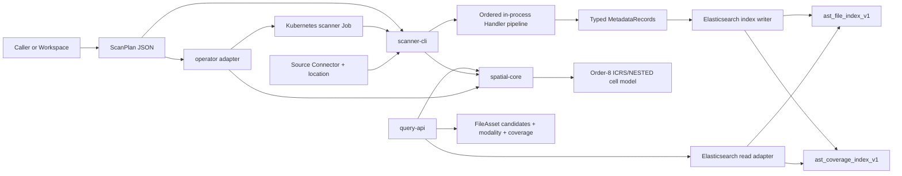

# Architecture

## Shape

The system has one domain core, one shared remote adapter, and three runtime integration modules. The domain core is deliberately independent of Kubernetes, Elasticsearch transport, and HTTP lifecycle concerns.



## Module Ownership

### `spatial-core`

`spatial-core` is the deepest module and the shared seam for the rest of the project. Its interface should express astronomy concepts rather than Kubernetes or Elasticsearch concepts.

It owns:

- FileAsset, SpatialCoverage, Modality, InputItem, ScanPlan, and SpatialQuery types.
- Validation of coordinates, plan shape, supported source/format combinations, and query parameters.
- Stable source URI canonicalization and FileAsset ID derivation.
- HEALPix order-8 normalization and point/cone/pixel query-cell conversion.
- FITS WCS and catalog spatial extraction contracts and implementations.
- File and coverage index document models.
- Typed MetadataRecord definitions and Handler-facing context.

It does not own network clients, Kubernetes resources, HTTP handlers, or Elasticsearch request construction.

### `index-elasticsearch`

`index-elasticsearch` owns the network-facing Elasticsearch adapter shared by scanner and query processes. It uses the JDK HTTP client, writes only the two fixed indices, uses deterministic document IDs, bounded retry for transient writes, and encodes search-after cursor state with a query-cell fingerprint.

It does not own scan orchestration, FITS parsing, or HTTP API routes.

### `scanner-cli`

`scanner-cli` owns the write-side execution path:

- Read and validate plan JSON.
- Enumerate S3, OSS, or local files.
- Apply filters.
- Run the ordered Handler pipeline in one process per InputItem.
- Send typed records to the index writer.
- Report bounded progress and a final summary without credentials.

The scanner depends on `spatial-core`, `index-elasticsearch`, and its S3-compatible source adapter. It does not depend on the query API or Operator.

### `query-api`

`query-api` owns the read-side HTTP process:

- Parse and validate point, cone, and HEALPix requests.
- Ask `spatial-core` to normalize the query to order-8 cells.
- Read coverage and file documents through an Elasticsearch adapter.
- De-duplicate FileAssets and encode/decode search-after cursors.
- Return stable, bounded pages.

The query API depends on `spatial-core` and the read side of `index-elasticsearch`; it does not depend on the scanner lifecycle and has no write capability.

### `operator`

`operator` is a thin Kubernetes adapter. It is part of the product, but it is not the domain core.

It owns:

- An astronomy-specific scan request CRD when Kubernetes submission is introduced.
- Plan validation delegation and Connector/credential reference validation.
- Scanner Job creation from a canonical ScanPlan.
- Job status observation and task status mapping.
- Retry, concurrency, and resource cleanup policy for the Kubernetes execution resource.

It does not own:

- FITS/WCS/HEALPix calculations.
- CSV parsing.
- Elasticsearch bulk requests.
- Query behavior.
- Generic workflow or Cron orchestration.

## Dependency Direction

```text
spatial-core
      ^
      |
index-elasticsearch
    ^           ^
    |           |
scanner-cli  query-api
    ^
    |
operator
```

`spatial-core` must not import any of the integration modules. The scanner, query API, and Operator may each have their own adapters around external systems.

## Processing Flow

1. A caller supplies a finite ScanPlan with a source Connector, source location, filters, Handler order, and one sink Connector.
2. The scanner validates the plan before enumeration.
3. A source adapter lists InputItems and provides content access only when a Handler needs it.
4. Handlers run in the declared order for each InputItem and share a context containing prior parsing results.
5. Handlers append typed MetadataRecords. FITS and catalog handlers may emit spatial evidence; the coverage step normalizes and de-duplicates cells.
6. The index writer creates one FileAsset document and zero or more SpatialCoverage documents per InputItem.
7. The writer uses deterministic IDs and bounded bulk requests with retry behavior.
8. The query API maps a request to order-8 cells, searches coverage, joins to FileAssets, de-duplicates by FileAsset ID, and returns a cursor page.

## Deep Modules And Seams

The main design goal is leverage and locality:

- The `spatial-core` interface hides coordinate conversion, WCS edge cases, catalog value validation, and stable ID rules from three callers.
- The source enumeration interface hides S3, OSS, and local listing differences from Handler logic.
- The record writer interface hides Elasticsearch bulk transport from Handler logic.
- The query read interface hides Elasticsearch joins and search-after details from HTTP parsing.
- The Operator Job adapter hides Kubernetes resource shape from the scanner.

One concrete adapter is initially a hypothetical seam. Once local, S3, and OSS sources are all implemented, the source seam is real. Tests should use the highest useful seam: domain tests for spatial behavior, adapter contract tests for transport behavior, and a small vertical integration test for the complete scan/query loop.

## Failure Ownership

| Failure | Owner | Observable result |
| --- | --- | --- |
| Invalid coordinate or plan | `spatial-core` validation | Rejected before scan or query execution |
| Source listing failure | scanner source adapter | Scan fails with redacted source error |
| FITS header/WCS invalid | FITS Handler | FileAsset may remain indexed with spatial status unknown/error; run reports the item failure according to scan policy |
| Catalog coordinate invalid | catalog Handler | Invalid rows are not used for coverage; file-level outcome is reported |
| Elasticsearch bulk transport failure | index writer | Bounded retry, then failed run with no secret material in the message |
| Query index unavailable | query read adapter | HTTP error with stable public error shape |
| Kubernetes Job failure | Operator | Task status reflects failed execution and Job diagnostics |
